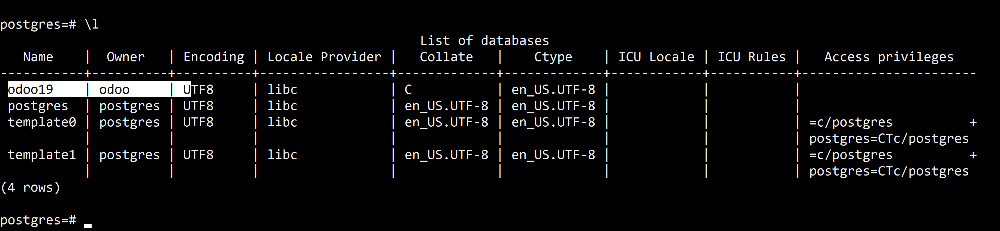
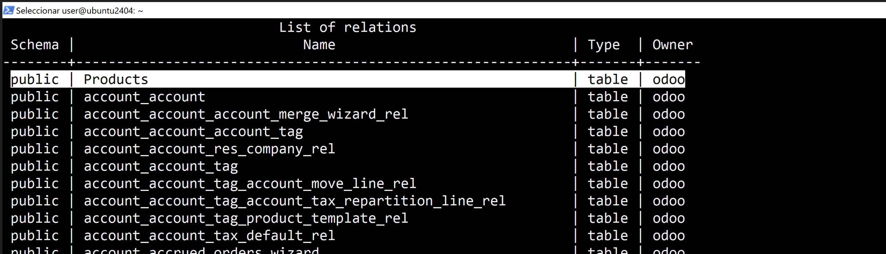
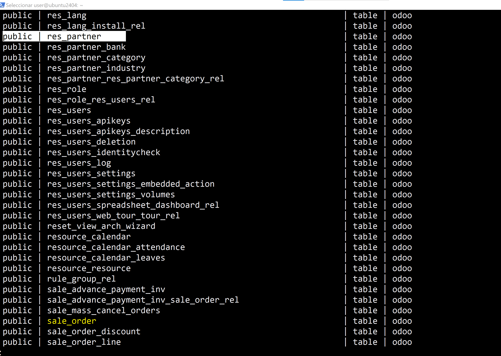
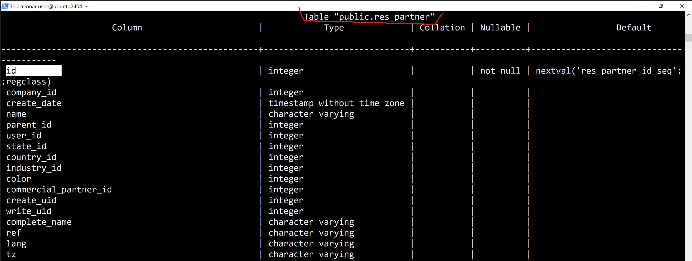
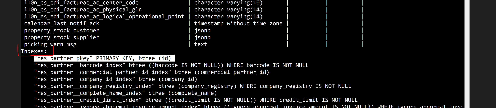
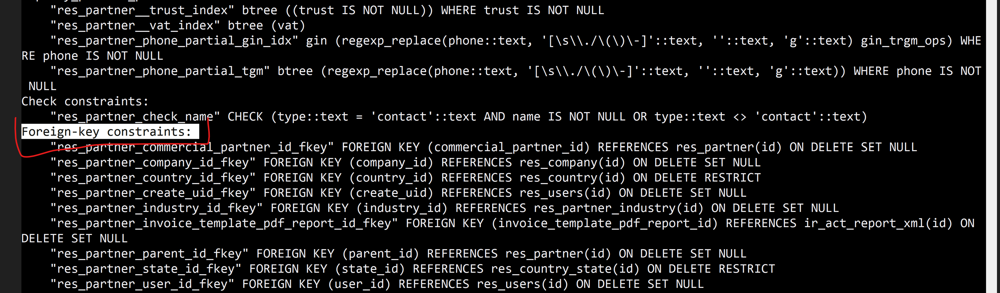

# Análisis del modelo de datos
#### Como funciona Odoo
1. Tablas -> donde se guarda la información
2. Campos -> datos dentro de las tablas
3. Relaciones -> como se conectan entre sí

Ej. Clientes, Productos, Ventas

#### Entrar en PostgreSQL
```
sudo -u postgres psql
```


##### Ver base de datos
```
\l
```



```
\c odoo19
```


#### Buscar tablas importantes
```
\dt
```




-------------
| Tipo de dato | Tabla | Observaciones |
| -------------| ------|---------------|
| Clientes    | res_partner | guarda clientes, contactos y empresas |
| Productos  | product_template | guarda información general de los productos |
| Ventas   | sale_order  | guarda los pedidos |
--------------

#### Analizar estructura de tablas
- Toca ver que campos tiene cada tabla y localizar las claves.
```
\d res_partner
\d sale_order
\d product_template
```






#### Relaciones entre tablas
1 . Cliente y venta
-   Tabla principal de clientes: res_partner
-   Tabla de ventas: sale_order
-   Relación: sale_order.partner_id -> sale_order.id
----
- Un cliente puede tener varias ventas. Una venta puede tener varias lineas. Cada línea de venta apunta a un producto.